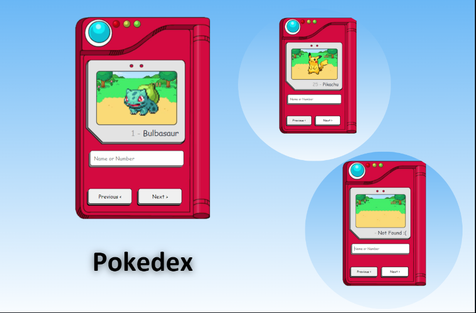

# Pokedex 📱

## Sobre o projeto ✨
A Pokedex foi feito apenas por fins de aprendizado. 

## Apresentação 👀

  

## Como acessar o projeto? 🤔

Basta clicar [AQUI](https://paulocesargit.github.io/pokedex/index.html) que você será direcionado!

# Tecnologias utilizadas 💻
- HTML.
- CSS.
- JavaScript.
- Consumo de API.

# Inspiração 💡

Projeto feito a partir de uma vídeo aula gratuita no Manual do Dev no Youtube 📺. 
https://www.youtube.com/watch?v=SjtdH3dWLa8&ab_channel=ManualdoDev

# Autor 

Paulo Cesar
